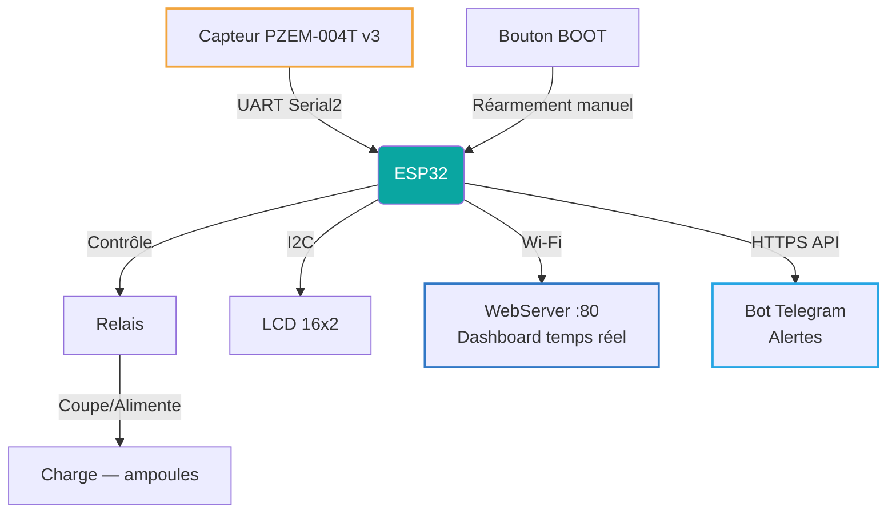
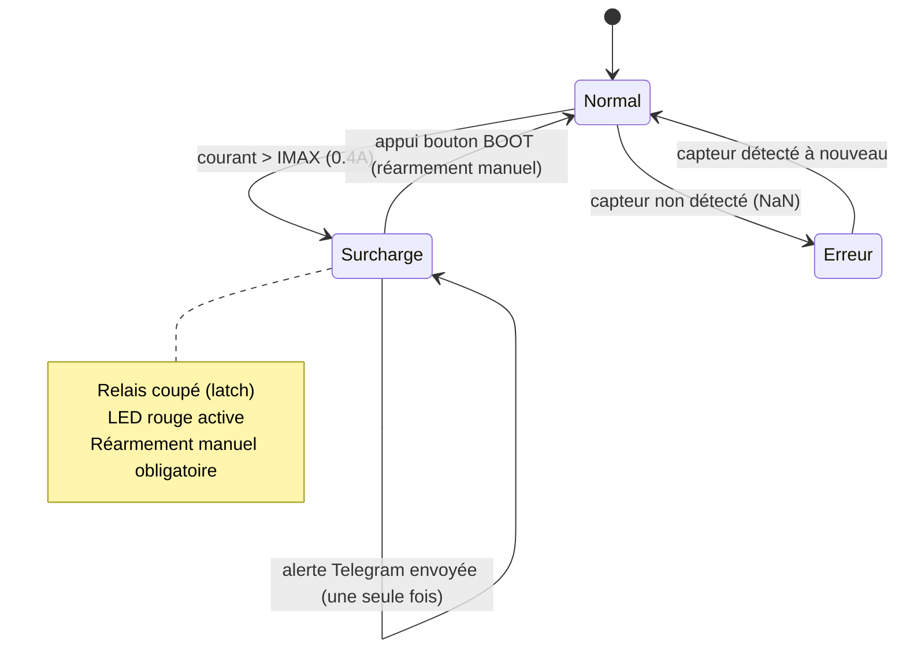
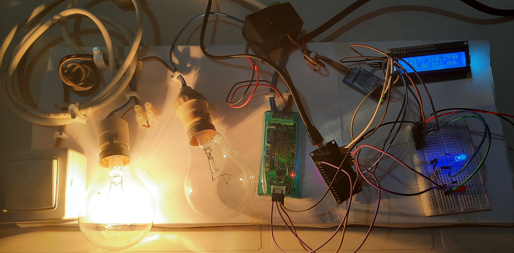
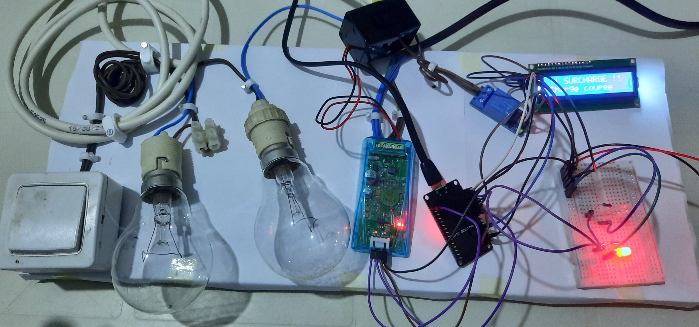
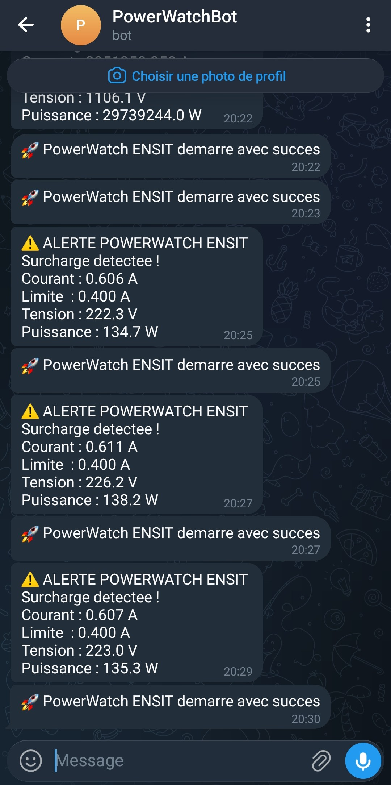
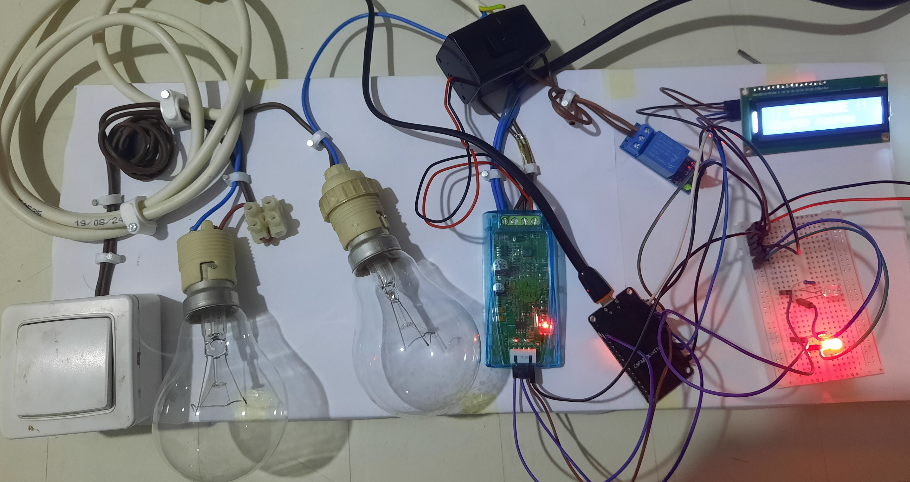

<div align="center">

# PowerWatch — Surveillance Énergétique Intelligente

### Protection électrique en temps réel avec alertes Telegram, ESP32 + PZEM-004T


`IoT` · `Protection Électrique` · `Dashboard Temps Réel` · `Alertes Automatiques`

</div>

---

## 📋 Vue d'ensemble

Système de surveillance et de protection électrique basé sur ESP32 et un capteur PZEM-004T v3.0. Le système mesure en continu la tension, le courant, la puissance, l'énergie, la fréquence et le facteur de puissance d'une installation, coupe automatiquement l'alimentation via un relais en cas de surcharge, envoie une alerte instantanée sur Telegram, et expose un dashboard web temps réel avec jauges et graphiques d'évolution.

## ⚙️ Contributions clés

- ⚡ Surveillance en temps réel des grandeurs électriques (U, I, P, Énergie, Fréquence, cos φ) via PZEM-004T
- 🛡️ Protection automatique par relais avec coupure en cas de dépassement de seuil de courant (latch — réarmement manuel obligatoire)
- 📩 Alerte Telegram automatique et instantanée dès détection d'une surcharge, avec les valeurs mesurées
- 🌐 Dashboard web embarqué (ESP32 WebServer) avec jauges, seuils visuels et graphiques d'évolution temps réel (Chart.js)
- 🖥️ Affichage local sur LCD I2C 16x2, avec retour d'état (normal / surcharge / erreur capteur)
- 🔌 Simulation d'une surcharge réelle validée avec deux charges physiques (ampoules)

## 🏗️ Architecture du système



## 🔄 Logique de détection et protection (machine à états)



Le comportement **latch** est un choix de sécurité volontaire : après une surcharge, le système reste coupé jusqu'à une intervention manuelle (bouton BOOT), plutôt que de se réarmer automatiquement dès que le courant redescend — évitant ainsi les cycles de coupure/reprise répétés sur une charge défaillante.

## 🎥 Le système en action

### État normal — mesures en direct sur LCD

<div align="center">
  
  <br><em>LED d'état allumée (normal), LCD affichant tension, courant, puissance et énergie en temps réel</em>
</div>

### État surcharge — coupure automatique

<div align="center">
  
  <br><em>LED d'alerte activée, LCD affichant "SURCHARGE - CHARGE COUPÉE" après dépassement du seuil</em>
</div>

### Alertes Telegram en temps réel

<div align="center">
  
  <br><em>Notifications automatiques envoyées dès détection d'une surcharge, avec courant/tension/puissance mesurés</em>
</div>

### Montage physique complet

<div align="center">
  
  <br><em>PZEM-004T, relais, ESP32, LCD I2C et charges de test (ampoules)</em>
</div>

## 🔧 Matériel

| Composant | Rôle |
|---|---|
| ESP32 DevKit | Contrôleur principal — Wi-Fi, logique, serveur web |
| PZEM-004T v3.0 | Capteur de mesure électrique (U, I, P, E, f, cos φ) |
| Module relais | Coupure de charge en cas de surcharge |
| LCD I2C 16x2 (PCF8574) | Affichage local des mesures et de l'état |
| Bouton BOOT (GPIO 0) | Réarmement manuel après surcharge |
| LEDs verte / rouge | Indicateur visuel d'état (normal / surcharge) |

## ⚡ Configuration clé

| Paramètre | Valeur |
|---|---|
| Liaison PZEM | Serial2, RX=16, TX=17 |
| Seuil de surcharge (IMAX) | 0.4 A |
| Fréquence de rafraîchissement | Toutes les 2 secondes |
| Dashboard web | Port 80, endpoint `/data` (JSON), auto-refresh JS |
| Alertes | API Telegram Bot (HTTPS, `WiFiClientSecure`) |

## 💻 Code — Détection de surcharge et coupure (latch)

```cpp
if (courant > IMAX && !surcharge) {
    surcharge = true;
    RELAIS_OFF();
    led_surcharge();

    if (!surchargeEnvoyee) {
        String msg = "⚠️ ALERTE POWERWATCH ENSIT\n";
        msg += "Surcharge detectee !\n";
        msg += "Courant : " + String(courant, 3) + " A\n";
        msg += "Limite  : " + String(IMAX, 3) + " A";
        sendTelegramAlert(msg);
        surchargeEnvoyee = true;   // Alerte envoyée une seule fois
    }
}
```

## 💻 Code — Réarmement manuel après surcharge

```cpp
if (surcharge && digitalRead(BTN_RESET) == LOW) {
    surcharge = false;
    surchargeEnvoyee = false;   // Réarme l'alerte Telegram
    RELAIS_ON();
    pzem.resetEnergy();
    led_normal();
    sendTelegramAlert("✅ Systeme rearme manuellement.");
}
```

## 💻 Code — Endpoint JSON pour le dashboard web

```cpp
void route_data() {
    bool erreur = isnan(tension) || isnan(courant);
    String json = "{";
    json += "\"tension\":"   + String(erreur ? 0 : tension,   1) + ",";
    json += "\"courant\":"   + String(erreur ? 0 : courant,   3) + ",";
    json += "\"puissance\":" + String(erreur ? 0 : puissance, 1) + ",";
    json += "\"surcharge\":" + String(surcharge ? "true" : "false") + ",";
    json += "\"erreur\":"    + String(erreur    ? "true" : "false");
    json += "}";
    server.send(200, "application/json", json);
}
```

## 🚀 Build & Flash

1. Ouvrir le projet dans Arduino IDE ou PlatformIO
2. Installer les librairies : `PZEM004Tv30`, `LiquidCrystal_I2C`, `UniversalTelegramBot`, `WiFi`, `WebServer`
3. Renseigner `ssid`, `password`, `BOT_TOKEN` et `CHAT_ID` dans le code (⚠️ ne jamais committer ces valeurs en clair)
4. Compiler et flasher sur l'ESP32
5. Ouvrir l'adresse IP affichée sur le port série pour accéder au dashboard web

## 🔭 Pistes d'amélioration

- **Externaliser les identifiants sensibles** (Wi-Fi, token Telegram) dans un fichier de configuration non versionné (`secrets.h` + `.gitignore`)
- **Historisation des données** : stocker les mesures (SPIFFS, carte SD, ou base de données distante) pour une analyse a posteriori
- **Réarmement automatique après délai** en complément du réarmement manuel, pour les cas de surcharge transitoire
- **Notifications multicanal** : ajouter e-mail ou push en plus de Telegram
- **Authentification du dashboard web** pour éviter tout accès non autorisé sur le réseau local

## 🛠 Tech Stack

`ESP32` · `PZEM-004T v3` · `C++ (Arduino)` · `WebServer` · `Telegram Bot API` · `Chart.js` · `LCD I2C` · `IoT` · `Protection électrique`

## 📄 License

MIT
